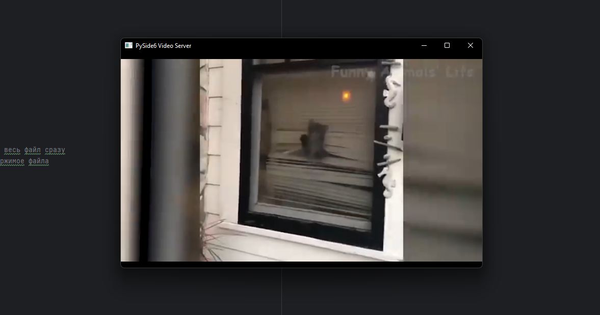

Задание: Task_4 Клиент отправляет видео на PySide6 сервер, где проиходит отображение этого видео в виджете.
# Описание программы 4:
В этих двух программах сервира и клиента я реализовал отправку видео на сервер PySide6 и его воспроизведения.

# Листинг 4:
Сервер(server.py)
```Py
#Импорт библиотек
from PySide6.QtCore import QUrl, QByteArray, QTimer
from PySide6.QtMultimedia import QMediaPlayer
from PySide6.QtMultimediaWidgets import QVideoWidget
from PySide6.QtNetwork import QTcpServer, QTcpSocket
from PySide6.QtWidgets import QApplication, QMainWindow
import os


class VideoServer(QMainWindow):
    def __init__(self):
        super().__init__()
        self.setWindowTitle("PySide6 Video Server")

        # Настройка виджета для видео
        self.video_widget = QVideoWidget()
        self.setCentralWidget(self.video_widget)

        # Настройка QMediaPlayer
        self.media_player = QMediaPlayer()
        self.media_player.setVideoOutput(self.video_widget)

        # Логирование ошибок
        self.media_player.errorOccurred.connect(self.on_error)
        self.media_player.mediaStatusChanged.connect(self.on_media_status)

        # Настройка TCP-сервера
        self.tcp_server = QTcpServer(self)
        if not self.tcp_server.listen(port=12345):
            print(f"Не удалось запустить сервер: {self.tcp_server.errorString()}")
            return

        print("Сервер запущен на порту 12345")
        self.tcp_server.newConnection.connect(self.handle_new_connection)

        self.client_socket = None
        self.buffer = QByteArray()

    def handle_new_connection(self):#функция обработки подключений
        self.client_socket = self.tcp_server.nextPendingConnection()
        self.client_socket.readyRead.connect(self.read_data)
        self.client_socket.disconnected.connect(self.client_socket.deleteLater)
        print("Клиент подключен")

    def read_data(self):#чтение данных от клиента
        while self.client_socket.bytesAvailable():
            self.buffer.append(self.client_socket.readAll())

        # Если передача завершена, сохраняем данные в видеофайл
        if b'EOF' in self.buffer.data():
            print("Передача завершена")
            self.buffer.remove(self.buffer.indexOf(b'EOF'), 3)  # Удаляем маркер EOF
            video_file = "received_video.mp4"
            with open(video_file, 'wb') as f:
                f.write(self.buffer)
            self.buffer.clear()
            print(f"Видео сохранено как {video_file}")

            # Проверяем размер файла
            file_size = os.path.getsize(video_file)
            print(f"Размер файла: {file_size} байт")

            # Воспроизводим видео
            self.media_player.setSource(QUrl.fromLocalFile(video_file))
            self.media_player.play()

    def on_error(self, error):
        print(f"Ошибка воспроизведения: {error}, {self.media_player.errorString()}")

    def on_media_status(self, status):
        print(f"Статус медиа: {status}")


if __name__ == "__main__":
    app = QApplication([])
    server = VideoServer()
    server.show()
    app.exec()
```
Клиент(client.py)
```Py
import sys
from PySide6.QtNetwork import QTcpSocket
from PySide6.QtCore import QIODevice, QByteArray


def send_video():
    file_path = "C:\\Users\\kiril\\Desktop\\sssss\\3.mp4"
    host = "localhost"
    port = 12345

    socket = QTcpSocket()
    socket.connectToHost(host, port)

    if not socket.waitForConnected(5000):
        print("Не удалось подключиться к серверу")
        return

    print("Подключено к серверу")

    # Чтение файла и отправка его содержимого
    try:
        with open(file_path, "rb") as f:
            buffer = QByteArray(f.read())  # Читаем весь файл сразу
            socket.write(buffer)  # Отправляем содержимое файла
            socket.waitForBytesWritten(5000)

        # Добавляем маркер окончания передачи
        socket.write(b'EOF')
        socket.waitForBytesWritten(5000)
        print("Видео отправлено")
    except FileNotFoundError:
        print(f"Файл {file_path} не найден")
    except Exception as e:
        print(f"Ошибка: {e}")
    finally:
        socket.close()

if __name__ == "__main__":
    send_video()
```


